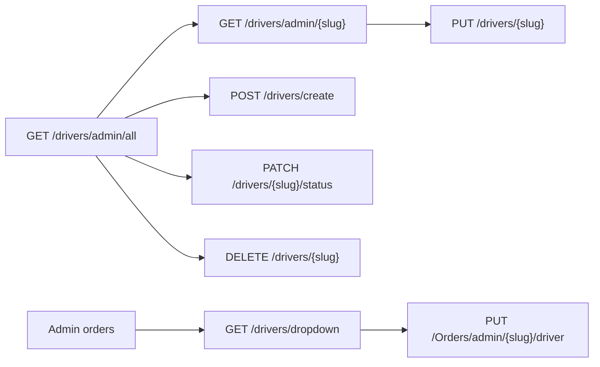

# Drivers — Admin API Integration Guide

Backend API for the **admin drivers module**: list, detail, create, edit, toggle availability, delete, dropdown (assign to orders), and order driver assignment.

---

## Base URL

| Environment | URL |
|-------------|-----|
| Local HTTP | `http://localhost:5244` |
| Local HTTPS | `https://localhost:7168` |
| Swagger | `/swagger` |

Driver routes are under:

```
/api/drivers
```

Order assignment uses:

```
/api/Orders
```

---

## Authentication

Authorization is commented out in development. When enabled, **admin JWT** required:

```
Authorization: Bearer <token>
Accept-Language: en | ar
```

---

## Standard response envelope

```json
{
  "isSuccess": true,
  "data": { },
  "error": { "code": "", "message": "" },
  "status": "Success",
  "statusCode": "Success",
  "hasValue": true,
  "message": null
}
```

Paginated list adds `X-Pagination` header:

```json
{"currentPage":1,"totalPages":2,"pageSize":50,"totalCount":10,"hasPrevious":false,"hasNext":false}
```

---

## TypeScript models

```typescript
interface ImageDto {
  path: string | null; // send back on create/update
  url: string;          // use for 
}

interface DriverDto {
  id: string;
  slug: string;
  fullName: string;
  email: string;
  phone: string;
  photo: ImageDto | null;
  status: DriverStatus;
  ordersCount: number;
  createdAt: string | null;
}

interface DriverDropdownDto {
  id: string;
  slug: string;
  fullName: string;
  email: string;
  status: DriverStatus;
}

enum DriverStatus {
  Available = 1,    // API enum: Avilable
  Unavailable = 2,  // API enum: UnAvilable
}
```

> **Note:** Backend enum members are spelled `Avilable` / `UnAvilable` (typo preserved). Serialized JSON values are integers `1` and `2`.

---

## Photo upload

Upload before create/update:

```
POST /api/FileUpload/upload
Content-Type: multipart/form-data
```

| Field | Value |
|-------|-------|
| `file` | image file |
| `folder` | e.g. `drivers` |

Use the returned **path** string in create/update body:

```json
{ "photo": "uploads/drivers/abc.jpg" }
```

On **GET** list/detail, `photo` is an `ImageDto` object — display `photo.url`, save `photo.path`.

---

## Endpoints

### 1. List drivers (admin table)

```
GET /api/drivers/admin/all
```

| Query | Type | Default | Notes |
|-------|------|---------|-------|
| `pageNumber` | int | `1` | |
| `pageSize` | int | `50` | |
| `keyword` | string? | | Search full name, email, phone |
| `status` | int? | | `1` = Available, `2` = Unavailable |
| `sortBy` | string | `createdAt` | `fullName`, `name`, `email`, `phone`, `status`, `ordersCount`, `createdAt` |
| `sortDirection` | string | `desc` | `asc` / `desc` |

**Response `data.items[]`:**

```json
{
  "id": "55555555-5555-4555-8555-000000000001",
  "slug": "ahmed-al-rashid",
  "fullName": "Ahmed Al-Rashid",
  "email": "driver01@demo.cleno.sa",
  "phone": "+966531234567",
  "photo": { "path": null, "url": "" },
  "status": 1,
  "ordersCount": 3,
  "createdAt": "2025-10-27T00:00:00Z"
}
```

`ordersCount` = total orders ever assigned to this driver (all statuses).

---

### 2. Get driver by slug (detail / edit form)

```
GET /api/drivers/admin/{slug}
```

Same `DriverDto` shape as list item.

**Errors:** `404` if slug not found.

---

### 3. Drivers dropdown (assign driver modal)

```
GET /api/drivers/dropdown?includeAll=false
```

| Query | Type | Default | Notes |
|-------|------|---------|-------|
| `includeAll` | bool | `false` | `false` → only **available** drivers (`status = 1`); `true` → all drivers |

**Response `data`:** array (not paginated)

```json
[
  {
    "id": "55555555-5555-4555-8555-000000000001",
    "slug": "ahmed-al-rashid",
    "fullName": "Ahmed Al-Rashid",
    "email": "driver01@demo.cleno.sa",
    "status": 1
  }
]
```

Sorted by `fullName` ascending. Use this for order assignment UI.

---

### 4. Create driver

Creates an `ApplicationUser` with **Driver** role + a `Driver` record.

```
POST /api/drivers/create
```

**Request body:**

```json
{
  "fullName": "Ahmed Al-Rashid",
  "email": "newdriver@company.bh",
  "phone": "+973 3300 1122",
  "password": "SecurePass123!",
  "photo": "uploads/drivers/photo.jpg",
  "status": 1
}
```

| Field | Required | Notes |
|-------|----------|-------|
| `fullName` | yes | |
| `email` | yes | Must be unique |
| `phone` | yes | |
| `password` | yes | Identity password rules apply |
| `photo` | no | Path from upload |
| `status` | no | Default `1` (Available) |

**Response `data`:** new driver `Guid` (driver id, not user id).

**Errors:**

| Code | When |
|------|------|
| `409 Conflict` | Email already used |
| `400 Bad Request` | Invalid status, password validation failed |

---

### 5. Update driver

```
PUT /api/drivers/{slug}
```

**Request body:**

```json
{
  "fullName": "Ahmed Al-Rashid",
  "email": "driver01@demo.cleno.sa",
  "phone": "+966531234567",
  "photo": "uploads/drivers/photo.jpg",
  "status": 1
}
```

| Field | Notes |
|-------|-------|
| `fullName` | Changing name regenerates `slug` |
| `email` | Must be unique; updates login username |
| `password` | **Not supported** on this endpoint |

**Response `data`:** `true`

**Errors:** `404` not found, `409` email conflict, `400` invalid status.

---

### 6. Toggle availability

Flips between Available (`1`) and Unavailable (`2`).

```
PATCH /api/drivers/{slug}/status
```

No request body.

**Response `data`:** new status integer

```json
2
```

Use for quick enable/disable in the drivers table without opening the edit form.

---

### 7. Delete driver

```
DELETE /api/drivers/{slug}
```

Deletes the `Driver` row and linked `ApplicationUser`.

**Response `data`:** `true`

**Errors:**

| Code | When |
|------|------|
| `404` | Driver not found |
| `400` | Driver has **active** orders (status not Delivered or Cancelled) |

---

## Order driver assignment (admin)

Assign or unassign a driver on an order from the admin orders UI.

```
PUT /api/Orders/admin/{orderSlug}/driver
```

**Request body:**

```json
{
  "driverId": "55555555-5555-4555-8555-000000000001"
}
```

Unassign (clear driver):

```json
{
  "driverId": null
}
```

**Response `data`:** `true`

**Rules:**

- Order must **not** be `Delivered` (5) or `Cancelled` (6)
- Assigned driver must have `status = 1` (Available)
- Unassigning (`driverId: null`) is always allowed on non-terminal orders
- Successful assign writes a `CompanyActivity` event (`driver_assigned`) on the order's company

**Errors:**

| Code | When |
|------|------|
| `404` | Order or driver not found |
| `400` | Terminal order, or driver unavailable |

---

## Driver fields on admin orders

When listing or viewing orders, driver info is embedded:

| Endpoint | Driver fields |
|----------|---------------|
| `GET /api/Orders/admin/all` | `driverId`, `driverSlug`, `driverName`, `driverEmail` |
| `GET /api/Orders/admin/{slug}` | same |

Example snippet from order list item:

```json
{
  "driverId": "55555555-5555-4555-8555-000000000001",
  "driverSlug": "ahmed-al-rashid",
  "driverName": "Ahmed Al-Rashid",
  "driverEmail": "driver01@demo.cleno.sa"
}
```

`driverId` / `driverName` are `null` when no driver assigned. Admin orders keyword search also matches driver name and email.

---

## Enums

### Driver `status`

| Value | API name | UI label (suggested) |
|-------|----------|----------------------|
| 1 | `Avilable` | Available |
| 2 | `UnAvilable` | Unavailable |

### Related order `status` (assignment rules)

| Value | Meaning |
|-------|---------|
| 1 | Order Created |
| 2 | Picked Up |
| 3 | In Laundry |
| 4 | Ready for Delivery |
| 5 | Delivered — **cannot assign** |
| 6 | Cancelled — **cannot assign** |

---

## Demo data

Password for all demo accounts: **`Demo@123`**

| Email | Driver slug | Status |
|-------|-------------|--------|
| `driver01@demo.cleno.sa` | `ahmed-al-rashid` | Available |
| `driver02@demo.cleno.sa` | `mohammed-al-faraj` | Available |
| … | … | … |
| `driver08@demo.cleno.sa` | `hassan-al-mutairi` | Unavailable |

10 demo drivers seeded via `04-drivers.sql` (after `02-identity.sql`).

---

## UI flow reference



---

## Frontend checklist

- [ ] Drivers table: `GET /api/drivers/admin/all` with keyword, status filter, sort, pagination
- [ ] Driver detail/edit: `GET /api/drivers/admin/{slug}` → `PUT /api/drivers/{slug}`
- [ ] Create form: `POST /api/drivers/create` (include password)
- [ ] Availability toggle: `PATCH /api/drivers/{slug}/status`
- [ ] Delete with confirmation; handle `400` if active orders exist
- [ ] Assign driver modal: `GET /api/drivers/dropdown` → `PUT /api/Orders/admin/{orderSlug}/driver`
- [ ] Display photos with `photo.url`; save with `photo.path` or upload path
- [ ] Map `status` `1`/`2` to Available / Unavailable badges
- [ ] Link from order row to driver profile via `driverSlug`

---

## Related docs

- [FRONTEND-API-HANDOFF.md](./FRONTEND-API-HANDOFF.md) — `ImageDto` breaking change, auth, demo accounts
- [COMPANIES-PROFILE-API.md](./COMPANIES-PROFILE-API.md) — company profile (activity includes `driver_assigned` events)
