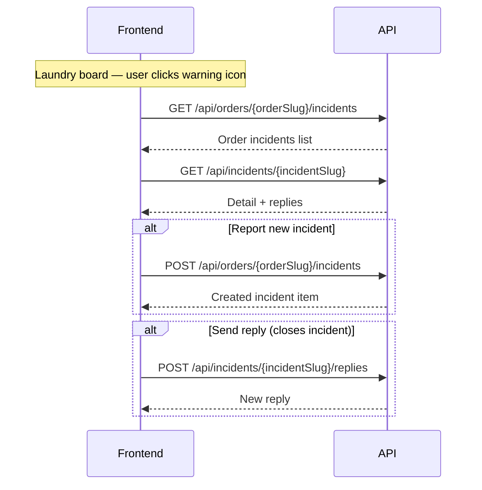

# Incidents — Application Layer & API Reference

This document describes the **Incidents** feature as implemented in `Cleno.Application`. Incidents let laundry staff report problems on an order (damaged bags, missing items, delays, etc.), view them per order, inspect detail with replies, and close them by replying.

Related docs:

- [LAUNDRY-OPS-API.md](./LAUNDRY-OPS-API.md) — Laundry board integration (`hasOpenIncidents`, urgency badge)
- [COMPANIES-PROFILE-API.md](./COMPANIES-PROFILE-API.md) — Company alerts count includes incidents

---

## Application structure

```
Cleno.Application/Features/Incidents/
├── IncidentHelper.cs
├── Commands/
│   ├── CreateIncident/
│   │   └── CreateIncidentCommand.cs
│   ├── UpdateIncident/
│   │   └── UpdateIncidentCommand.cs
│   ├── DeleteIncident/
│   │   └── DeleteIncidentCommand.cs
│   ├── AddIncidentReply/
│   │   └── AddIncidentReplyCommand.cs
│   ├── UpdateIncidentReply/
│   │   └── UpdateIncidentReplyCommand.cs
│   └── DeleteIncidentReply/
│       └── DeleteIncidentReplyCommand.cs
└── Queries/
    ├── GetOrderIncidents/
    │   └── GetOrderIncidentsQuery.cs
    └── GetIncidentDetail/
        └── GetIncidentDetailQuery.cs
```

Domain entities live in `Cleno.Domain/Entities/Incident/`:

| Entity / Enum | File |
|---------------|------|
| `Incident` | `Incident.cs` |
| `IncidentReply` | `IncidentReply.cs` |
| `IncidentType` | `IncidentType.cs` |
| `IncidentStage` | `IncidentStage.cs` |

DbSets on `IApplicationDbContext`:

- `Incidents`
- `IncidentReplies`

---

## Domain model

### Incident

| Property | Type | Notes |
|----------|------|-------|
| `Id` | `Guid` | Primary key |
| `OrderId` | `Guid` | FK → Order (cascade delete) |
| `Type` | `IncidentType` | Required |
| `Stage` | `IncidentStage` | Required — laundry workflow stage when reported |
| `Title` | `string` | Max 200 chars |
| `Description` | `string` | Max 2000 chars |
| `Slug` | `string` | Auto-generated from title (unique, max 200) |
| `Replies` | `ICollection<IncidentReply>` | Thread of responses |
| Audit fields | — | `CreatedAt`, `CreatedBy`, etc. via `FullyAuditedBaseEntity` |

### IncidentReply

| Property | Type | Notes |
|----------|------|-------|
| `Id` | `Guid` | Primary key |
| `IncidentId` | `Guid` | FK → Incident (cascade delete) |
| `Message` | `string` | Max 2000 chars |
| `Slug` | `string` | Format: `{incidentId:N}-reply-{replyId:N}` |
| Audit fields | — | `CreatedAt`, `CreatedBy` |

---

## Enums

### IncidentType

| Value | Name | Label (`IncidentHelper.GetTypeLabel`) |
|------:|------|---------------------------------------|
| `1` | `DamagedBag` | Damaged Bag |
| `2` | `WrongItems` | Wrong Items |
| `3` | `MissingItems` | Missing Items |
| `4` | `Delay` | Delay |
| `5` | `Other` | Other |

### IncidentStage

| Value | Name | Label (`IncidentHelper.GetStageLabel`) |
|------:|------|----------------------------------------|
| `1` | `Incoming` | Incoming |
| `2` | `InLaundry` | In Laundry |
| `3` | `ReadyForDelivery` | Ready for Delivery |

### Stage auto-mapping from order status

When `CreateIncidentCommand.Stage` is omitted, `IncidentHelper.MapOrderStatusToStage` derives it:

| OrderStatus | IncidentStage |
|-------------|---------------|
| `PickedUp` (2) | `Incoming` |
| `InLaundry` (3) | `InLaundry` |
| `ReadyForDelivery` (4) | `ReadyForDelivery` |
| Any other | `Incoming` (default) |

---

## IncidentHelper

Shared utility in `Cleno.Application/Features/Incidents/IncidentHelper.cs`:

| Method | Purpose |
|--------|---------|
| `GetTypeLabel(IncidentType)` | Human-readable type label for API responses |
| `GetStageLabel(IncidentStage)` | Human-readable stage label for API responses |
| `MapOrderStatusToStage(OrderStatus)` | Default stage when creating an incident without explicit stage |

---

## Commands

### CreateIncidentCommand

**Namespace:** `Cleno.Application.Features.Incidents.Commands.CreateIncident`

**Request:** `IRequest<Result<OrderIncidentListItemDto>>`

| Field | Type | Required | Validation |
|-------|------|----------|------------|
| `RouteSlug` | `string` | Yes (from route) | Order slug — set by controller, not in JSON body |
| `Type` | `IncidentType` | Yes | Must be valid enum |
| `Stage` | `IncidentStage?` | No | Valid enum when provided; defaults from order status |
| `Title` | `string?` | No | Max 200 chars; defaults to type label |
| `Description` | `string` | Yes | Not empty, max 2000 chars |

**Handler behavior:**

1. Resolves order by `RouteSlug`; returns **404** if not found.
2. Sets `stage` = request stage or mapped from order status.
3. Sets `title` = trimmed request title or type label.
4. Creates `Incident` linked to the order.
5. Records company activity (`CompanyActivityType.IncidentReported`) via `CompanyActivityHelper`.
6. Saves and returns `OrderIncidentListItemDto` with `replyCount: 0`, `isOpen: true`.

**API endpoint:** `POST /api/orders/{slug}/incidents` (`OrdersController`)

---

### AddIncidentReplyCommand

**Namespace:** `Cleno.Application.Features.Incidents.Commands.AddIncidentReply`

**Request:** `IRequest<Result<IncidentReplyDto>>`

| Field | Type | Required | Validation |
|-------|------|----------|------------|
| `RouteSlug` | `string` | Yes (from route) | Incident slug — set by controller |
| `Message` | `string` | Yes | Not empty, max 2000 chars |

**Handler behavior:**

1. Resolves incident by slug; returns **404** if not found.
2. Creates `IncidentReply` with generated slug.
3. Returns `IncidentReplyDto` including `authorName` from `CreatedBy` user.

**Side effect:** Adding a reply closes the incident (`isOpen` becomes `false` — see open/closed logic below).

**API endpoint:** `POST /api/incidents/{slug}/replies` (`IncidentsController`)

---

### UpdateIncidentCommand

**Namespace:** `Cleno.Application.Features.Incidents.Commands.UpdateIncident`

**Request:** `IRequest<Result<OrderIncidentListItemDto>>`

| Field | Type | Required | Validation |
|-------|------|----------|------------|
| `RouteSlug` | `string` | Yes (from route) | Incident slug — set by controller |
| `Type` | `IncidentType` | Yes | Must be valid enum |
| `Stage` | `IncidentStage` | Yes | Must be valid enum |
| `Title` | `string?` | No | Max 200 chars; defaults to type label |
| `Description` | `string` | Yes | Not empty, max 2000 chars |

**Handler behavior:**

1. Resolves incident by slug; returns **404** if not found.
2. Updates type, stage, title, and description.
3. Regenerates slug when title changes.
4. Returns updated `OrderIncidentListItemDto`.

**API endpoint:** `PUT /api/incidents/{slug}` (`IncidentsController`)

---

### DeleteIncidentCommand

**Namespace:** `Cleno.Application.Features.Incidents.Commands.DeleteIncident`

**Request:** `IRequest<Result<bool>>`

**Handler behavior:**

1. Resolves incident by slug; returns **404** if not found.
2. Soft-deletes the incident (`IsDeleted = true`).

**API endpoint:** `DELETE /api/incidents/{slug}` (`IncidentsController`)

---

### UpdateIncidentReplyCommand

**Namespace:** `Cleno.Application.Features.Incidents.Commands.UpdateIncidentReply`

**Request:** `IRequest<Result<IncidentReplyDto>>`

| Field | Type | Required | Validation |
|-------|------|----------|------------|
| `RouteSlug` | `string` | Yes (from route) | Incident slug |
| `ReplyId` | `Guid` | Yes (from route) | Reply id |
| `Message` | `string` | Yes | Not empty, max 2000 chars |

**API endpoint:** `PUT /api/incidents/{slug}/replies/{replyId}` (`IncidentsController`)

---

### DeleteIncidentReplyCommand

**Namespace:** `Cleno.Application.Features.Incidents.Commands.DeleteIncidentReply`

**Request:** `IRequest<Result<bool>>`

**Handler behavior:**

1. Resolves reply by id + incident slug; returns **404** if not found.
2. Soft-deletes the reply. If all replies are removed, the incident becomes **open** again (`IsOpen = true`).

**API endpoint:** `DELETE /api/incidents/{slug}/replies/{replyId}` (`IncidentsController`)

---

## Queries

### GetOrderIncidentsQuery

**Namespace:** `Cleno.Application.Features.Incidents.Queries.GetOrderIncidents`

**Request:** `IRequest<Result<GetOrderIncidentsResult>>`

**Input:** `OrderSlug` (string)

**Response DTOs:**

```csharp
GetOrderIncidentsResult
├── OrderNumber: string
├── CompanyName: string
└── Incidents: List<OrderIncidentListItemDto>
    ├── Slug
    ├── Type / TypeLabel
    ├── Title
    ├── Summary          // maps from Description
    ├── Stage / StageLabel
    ├── CreatedAt
    ├── ReplyCount
    └── IsOpen
```

**Handler behavior:**

1. Loads order with incidents ordered by `CreatedAt` descending.
2. Returns **404** if order not found.
3. `IsOpen` = `ReplyCount == 0` (no replies yet).

**API endpoint:** `GET /api/orders/{slug}/incidents` (`OrdersController`)

---

### GetIncidentDetailQuery

**Namespace:** `Cleno.Application.Features.Incidents.Queries.GetIncidentDetail`

**Request:** `IRequest<Result<GetIncidentDetailResult>>`

**Input:** `IncidentSlug` (string)

**Response DTO:**

```csharp
GetIncidentDetailResult
├── Slug, Type, TypeLabel, Stage, StageLabel
├── Title, Description, CreatedAt
├── ReporterName         // from incident CreatedBy user
├── OrderNumber, CompanyName, OrderSlug
└── Replies: List<IncidentReplyDto>
    ├── Id
    ├── Message
    ├── AuthorName       // from reply CreatedBy user
    └── CreatedAt
```

**Handler behavior:**

1. Loads incident with order context and replies ordered by `CreatedAt` ascending.
2. Returns **404** if incident not found.
3. Populates `TypeLabel` and `StageLabel` via `IncidentHelper`.

**API endpoint:** `GET /api/incidents/{slug}` (`IncidentsController`)

---

## Open vs closed incidents

An incident is considered **open** when it has **zero replies**:

```
IsOpen = ReplyCount == 0
```

This drives:

| Consumer | Behavior |
|----------|----------|
| `GetOrderIncidentsQuery` | Sets `isOpen` per list item |
| `GetLaundryOrdersQuery` | Sets `hasOpenIncidents` on order cards |
| `LaundryOpsHelper.ResolveUrgencyBadge` | Returns `"WARNING"` when `hasOpenIncidents` is true (priority 3, after OVERDUE and URGENT) |

There is no explicit status field or close/update/delete command — replying is the only way to resolve an incident from the application's perspective.

---

## API endpoints summary

| Method | Route | MediatR handler | Controller |
|--------|-------|-----------------|------------|
| `GET` | `/api/orders/{slug}/incidents` | `GetOrderIncidentsQuery` | `OrdersController` |
| `POST` | `/api/orders/{slug}/incidents` | `CreateIncidentCommand` | `OrdersController` |
| `GET` | `/api/incidents/{slug}` | `GetIncidentDetailQuery` | `IncidentsController` |
| `PUT` | `/api/incidents/{slug}` | `UpdateIncidentCommand` | `IncidentsController` |
| `DELETE` | `/api/incidents/{slug}` | `DeleteIncidentCommand` | `IncidentsController` |
| `POST` | `/api/incidents/{slug}/replies` | `AddIncidentReplyCommand` | `IncidentsController` |
| `PUT` | `/api/incidents/{slug}/replies/{replyId}` | `UpdateIncidentReplyCommand` | `IncidentsController` |
| `DELETE` | `/api/incidents/{slug}/replies/{replyId}` | `DeleteIncidentReplyCommand` | `IncidentsController` |

---

## Base URL

| Environment | URL |
|-------------|-----|
| Local HTTP | `http://localhost:5244` |
| Local HTTPS | `https://localhost:7168` |
| Swagger | `/swagger` |

---

## Authentication

Authorization attributes are currently **commented out** in development. When enabled, endpoints will require the **Admin** role (or Laundry staff role):

```
Authorization: Bearer <token>
```

Optional localization:

```
Accept-Language: en | ar
```

Localized error messages:

| Scenario | English | Arabic |
|-------------|---------|--------|
| Order not found | Order not found. | الطلب غير موجود. |
| Incident not found | Incident not found. | البلاغ غير موجود. |

---

## Standard response envelope

All endpoints return `Result<T>`:

```json
{
  "isSuccess": true,
  "data": { },
  "error": { "code": "", "message": "" },
  "status": "Success",
  "statusCode": "Success",
  "hasValue": true,
  "message": null
}
```

Read the payload from **`data`**.

---

## Request / response examples

### POST — Create incident

```
POST /api/orders/org-040-abc/incidents
```

**Body:**

```json
{
  "type": 1,
  "stage": 1,
  "title": "Damaged Bag",
  "description": "Bag BAG-1038 arrived with damaged zipper"
}
```

- `stage` is optional — defaults from the order's current status.
- `title` is optional — defaults to the type label.

**Response `data` (`OrderIncidentListItemDto`):**

```json
{
  "slug": "damaged-bag-abc",
  "type": 1,
  "typeLabel": "Damaged Bag",
  "title": "Damaged Bag",
  "summary": "Bag BAG-1038 arrived with damaged zipper",
  "stage": 1,
  "stageLabel": "Incoming",
  "createdAt": "2026-06-23T19:27:00Z",
  "replyCount": 0,
  "isOpen": true
}
```

---

### GET — Order incidents list

```
GET /api/orders/org-040-abc/incidents
```

**Response `data`:**

```json
{
  "orderNumber": "ORG-040",
  "companyName": "Riyadh Grand Hotel",
  "incidents": [
    {
      "slug": "damaged-bag-abc",
      "type": 1,
      "typeLabel": "Damaged Bag",
      "title": "Damaged Bag",
      "summary": "Bag BAG-1038 arrived with damaged zipper",
      "stage": 1,
      "stageLabel": "Incoming",
      "createdAt": "2026-06-23T19:27:00Z",
      "replyCount": 0,
      "isOpen": true
    }
  ]
}
```

---

### GET — Incident detail

```
GET /api/incidents/damaged-bag-abc
```

**Response `data`:**

```json
{
  "slug": "damaged-bag-abc",
  "type": 1,
  "typeLabel": "Damaged Bag",
  "stage": 1,
  "stageLabel": "Incoming",
  "title": "Damaged Bag",
  "description": "Bag BAG-1038 arrived with damaged zipper",
  "createdAt": "2026-06-23T19:27:00Z",
  "reporterName": "Sara Al-Harbi",
  "orderNumber": "ORG-040",
  "companyName": "Riyadh Grand Hotel",
  "orderSlug": "org-040-abc",
  "replies": [
    {
      "id": "3fa85f64-5717-4562-b3fc-2c963f66afa6",
      "message": "We will replace the bag.",
      "authorName": "Admin User",
      "createdAt": "2026-06-24T10:00:00Z"
    }
  ]
}
```

---

### POST — Add reply

```
POST /api/incidents/damaged-bag-abc/replies
```

**Body:**

```json
{
  "message": "We will replace the bag and reprocess the items."
}
```

**Response `data` (`IncidentReplyDto`):**

```json
{
  "id": "3fa85f64-5717-4562-b3fc-2c963f66afa6",
  "message": "We will replace the bag and reprocess the items.",
  "authorName": "Admin User",
  "createdAt": "2026-06-24T10:00:00Z"
}
```

---

## Cross-feature integration

### Laundry Operations board

`GetLaundryOrdersQuery` exposes per-card incident flags:

| Field | Source |
|-------|--------|
| `hasOpenIncidents` | `o.Incidents.Any(i => !i.Replies.Any())` |
| `urgencyBadge` | `"WARNING"` when open incidents exist (unless OVERDUE or URGENT) |

UI flow: warning icon on order card → Incidents page → list + detail endpoints above.

### Company profile / activity

- **Create incident** records `CompanyActivityType.IncidentReported` with entity type `CompanyActivityEntityType.Incident`.
- **Company alerts count** (`CompanyProfileStatsHelper.GetAlertsCountAsync`) counts all incidents for the company's orders.

---

## Database

Tables: `Incidents`, `IncidentReplies` (migration `AddLaundryOpsEntities`).

```bash
dotnet ef database update --project Cleno.Persistence --startup-project Cleno.API
```

Demo seed data: `Cleno.Persistence/Seeders/Sql/07-notes-incidents.sql`

---

## What is NOT implemented

The Application layer currently has **no** handlers for:

- Explicit close/reopen status (beyond reply-based open/closed)
- List all incidents across orders (only per-order list)
- Pagination or filtering on incident lists
- File/photo attachments on incidents

---

## Recommended UI flow



---

## Changelog

| Date | Change |
|------|--------|
| 2026-06-29 | Initial Incidents Application layer documentation |
