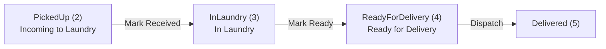
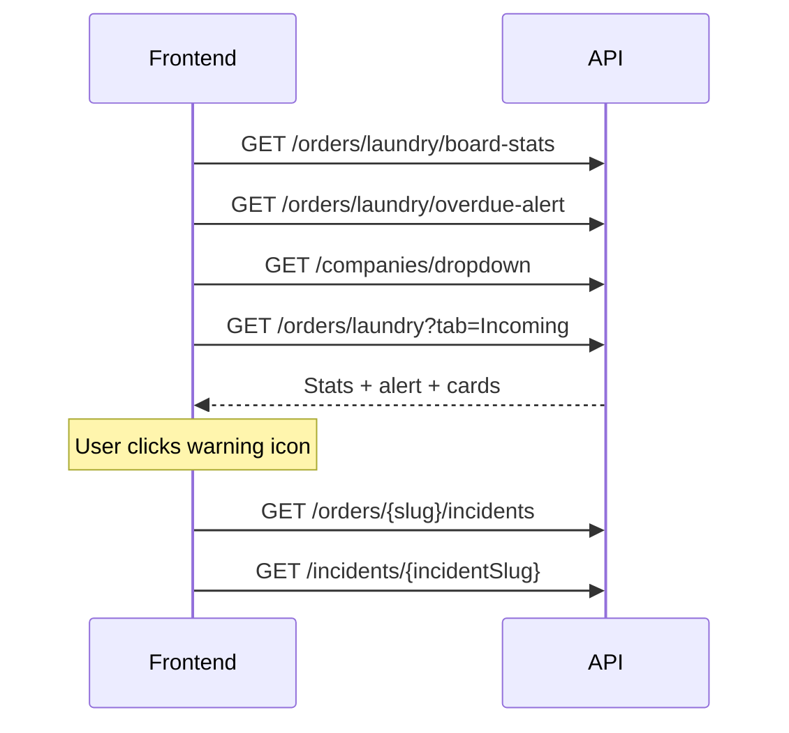

# Laundry Operations Page — API Integration Guide

This document describes the backend APIs for the **Laundry Operations** page: board stats, overdue alert, kanban tabs, bulk actions, notes, bag assignments, and incidents. Use it for frontend integration.

Related doc: [ORDERS-ADMIN-API.md](./ORDERS-ADMIN-API.md) (general admin orders, driver assign, single status update).

---

## Base URL

| Environment | URL |
|-------------|-----|
| Local HTTP | `http://localhost:5244` |
| Local HTTPS | `https://localhost:7168` |
| Swagger | `/swagger` |

Route prefixes used by this page:

```
/api/orders
/api/companies
/api/incidents
/api/drivers        (existing — assign driver on Ready for Delivery tab)
```

---

## Authentication

Authorization attributes are currently **commented out** in development. When enabled, laundry endpoints will require the **Admin** role (or Laundry staff role) and:

```
Authorization: Bearer <token>
```

Optional localization:

```
Accept-Language: en | ar
```

---

## Standard response envelope

All endpoints return `Result<T>`:

```json
{
  "isSuccess": true,
  "data": { },
  "error": { "code": "", "message": "" },
  "status": "Success",
  "statusCode": "Success",
  "hasValue": true,
  "message": null
}
```

Read the payload from **`data`**.

---

## Order lifecycle (Laundry Operations scope)



| Tab | `tab` query value | OrderStatus |
|-----|-------------------|-------------|
| Incoming to Laundry | `Incoming` | `2` PickedUp |
| In Laundry | `InLaundry` | `3` InLaundry |
| Ready for Delivery | `ReadyForDelivery` | `4` ReadyForDelivery |

**Existing endpoints reused on this page:**

| Action | Endpoint |
|--------|----------|
| Mark Received / Mark Ready / Dispatch (single card) | `PUT /api/orders/admin/{slug}/status` |
| Assign driver (Ready for Delivery tab) | `PUT /api/orders/admin/{slug}/driver` |
| Driver dropdown | `GET /api/drivers/dropdown` |

---

## Enums

### OrderStatus (relevant values)

| Value | Name | Laundry tab |
|------:|------|-------------|
| `2` | PickedUp | Incoming to Laundry |
| `3` | InLaundry | In Laundry |
| `4` | ReadyForDelivery | Ready for Delivery |
| `5` | Delivered | After Dispatch |

### OrderBagStage

| Value | Name | When used |
|------:|------|-----------|
| `1` | Pickup | Bags arriving with driver (Incoming tab) |
| `2` | Processing | Bags assigned during laundry (In Laundry tab) |

### BagStatus

| Value | Name |
|------:|------|
| `1` | PickedUp |
| `2` | AtLaundry |
| `3` | Processing |
| `4` | Ready |
| `5` | OutForDelivery |

### IncidentType

| Value | Name |
|------:|------|
| `1` | DamagedBag |
| `2` | WrongItems |
| `3` | MissingItems |
| `4` | Delay |
| `5` | Other |

### IncidentStage

| Value | Name |
|------:|------|
| `1` | Incoming |
| `2` | InLaundry |
| `3` | ReadyForDelivery |

---

## Urgency badge logic

Applied per order card on `GET /api/orders/laundry`:

| Badge | Condition | Priority |
|-------|-----------|----------|
| `OVERDUE` | Deliver-by datetime has passed | 1 (highest) |
| `URGENT` | Not overdue, but deliver-by within **4 hours** | 2 |
| `WARNING` | Has open incidents (incidents with **zero replies**) | 3 |
| `null` | None of the above | — |

**Deliver-by** = `PickupDate + 1 day` at the order time slot start time.

**Overdue alert banner** (`GET /api/orders/laundry/overdue-alert`) uses the same deliver-by rule for orders in status `2`, `3`, or `4`.

---

## Screen mapping

### Page load

| UI section | Endpoint |
|------------|----------|
| KPI stats bar (Received / Processed / Dispatched / Avg time / Bags in laundry) | `GET /api/orders/laundry/board-stats` |
| Red overdue banner | `GET /api/orders/laundry/overdue-alert` |
| Customer filter dropdown | `GET /api/companies/dropdown` |

### Board tabs + filters

| UI section | Endpoint |
|------------|----------|
| Order cards per tab | `GET /api/orders/laundry?tab=&search=&companyId=&sortBy=` |
| Bulk Mark Received / Mark Ready / Dispatch | `PUT /api/orders/laundry/bulk-status` |

### Card actions

| UI icon / button | Endpoint |
|------------------|----------|
| Plus icon → Add Note modal | `POST /api/orders/{slug}/notes` |
| Note list (optional) | `GET /api/orders/{slug}/notes` |
| Warning icon → Incidents page | `GET /api/orders/{slug}/incidents` |
| Assign Bags modal | `GET /api/orders/{slug}/bags` |
| Add / edit / delete bag assignment | `POST` / `PUT` / `DELETE /api/orders/{slug}/bags` |
| Assign Driver | `PUT /api/orders/admin/{slug}/driver` |
| Single Mark Received / Mark Ready / Dispatch | `PUT /api/orders/admin/{slug}/status` |

### Incidents page

| UI section | Endpoint |
|------------|----------|
| Left incident list | `GET /api/orders/{slug}/incidents` |
| Report new incident | `POST /api/orders/{slug}/incidents` |
| Incident detail + replies | `GET /api/incidents/{incidentSlug}` |
| Send reply | `POST /api/incidents/{incidentSlug}/replies` |

---

## Endpoints

### 1. Board stats

```
GET /api/orders/laundry/board-stats
```

**Response `data`:**

```json
{
  "receivedToday": 47,
  "processedToday": 32,
  "dispatchedToday": 28,
  "avgProcessingTimeMinutes": 222,
  "bagsInLaundry": 156
}
```

| Field | Calculation |
|-------|-------------|
| `receivedToday` | Status history: `InLaundry` transitions today |
| `processedToday` | Status history: `ReadyForDelivery` transitions today |
| `dispatchedToday` | Status history: `Delivered` transitions today |
| `avgProcessingTimeMinutes` | Avg of `(ReadyForDelivery − PickedUp)` for orders processed today |
| `bagsInLaundry` | Bags with status `AtLaundry` or `Processing` |

---

### 2. Overdue alert

```
GET /api/orders/laundry/overdue-alert
```

**Response `data`:**

```json
{
  "count": 2,
  "orders": [
    { "slug": "org-036-abc", "orderNumber": "ORG-036" },
    { "slug": "org-029-xyz", "orderNumber": "ORG-029" }
  ]
}
```

Hide the banner when `count === 0`. Each chip links to the order on the board.

---

### 3. Board orders

```
GET /api/orders/laundry?tab=Incoming&search=&companyId=&sortBy=newest
```

**Query parameters:**

| Param | Default | Values |
|-------|---------|--------|
| `tab` | `Incoming` | `Incoming`, `InLaundry`, `ReadyForDelivery` |
| `search` | — | Order #, company, branch, bag numbers |
| `companyId` | — | GUID — filter by company |
| `sortBy` | `newest` | `newest` (CreatedAt DESC), `oldest` (CreatedAt ASC) |

**Response `data.items[]`:**

```json
{
  "id": "3fa85f64-5717-4562-b3fc-2c963f66afa6",
  "slug": "org-040-abc",
  "orderNumber": "ORG-040",
  "companyName": "Riyadh Grand Hotel",
  "companyType": "Hotel",
  "branchName": "Al Olaya Branch",
  "status": 2,
  "isOverdue": false,
  "urgencyBadge": "WARNING",
  "durationInLaundryMinutes": null,
  "totalItems": 70,
  "bagCount": 3,
  "pickupTime": "06:27 PM",
  "deliverByTime": "01:27 AM",
  "hasOpenIncidents": true,
  "assignedDriverName": null,
  "items": [
    {
      "laundryItemId": "guid",
      "itemName": "Duvet Cover",
      "category": 1,
      "quantity": 10,
      "unitPrice": 25.00,
      "subtotal": 250.00
    }
  ],
  "bags": [
    {
      "bagId": "guid",
      "bagNumber": "PROC-2001",
      "stage": 2,
      "bagStatus": 3
    }
  ]
}
```

**Notes:**

- `id` is used for bulk selection (`PUT /laundry/bulk-status`).
- `bags[]` on Incoming tab shows `Pickup` stage bags; other tabs show `Processing` stage bags.
- `hasOpenIncidents` = any incident on the order with no replies.

---

### 4. Bulk status update

```
PUT /api/orders/laundry/bulk-status
```

**Body:**

```json
{
  "ids": [
    "3fa85f64-5717-4562-b3fc-2c963f66afa6",
    "4fa85f64-5717-4562-b3fc-2c963f66afa7"
  ],
  "status": 3
}
```

| Tab action | Required current status | `status` to send |
|------------|-------------------------|------------------|
| Mark Selected as Received | `2` PickedUp | `3` |
| Mark Selected as Ready | `3` InLaundry | `4` |
| Dispatch Selected | `4` ReadyForDelivery | `5` |

**Response `data`:**

```json
{
  "succeeded": ["3fa85f64-5717-4562-b3fc-2c963f66afa6"],
  "failed": [
    {
      "id": "4fa85f64-5717-4562-b3fc-2c963f66afa7",
      "reason": "Order is not in PickedUp status."
    }
  ]
}
```

Partial success is supported — valid orders update even if some fail.

---

### 5. Companies dropdown

```
GET /api/companies/dropdown
```

**Response `data[]`:**

```json
{
  "id": "guid",
  "slug": "riyadh-grand-hotel",
  "name": "Riyadh Grand Hotel"
}
```

Returns approved, active parent companies only.

---

### 6. Order notes

```
GET  /api/orders/{slug}/notes
POST /api/orders/{slug}/notes
```

**POST body:**

```json
{ "content": "Handle with care — fragile items in bag 2." }
```

**GET response `data`:**

```json
{
  "orderNumber": "ORG-029",
  "notes": [
    {
      "id": "guid",
      "content": "Handle with care...",
      "createdAt": "2026-06-24T22:30:00Z",
      "authorName": "Sara Al-Harbi"
    }
  ]
}
```

---

### 7. Bag assignments

```
GET    /api/orders/{slug}/bags
POST   /api/orders/{slug}/bags
PUT    /api/orders/{slug}/bags/{assignmentId}
DELETE /api/orders/{slug}/bags/{assignmentId}
```

**POST body:**

```json
{
  "bagNumber": "PROC-2001",
  "laundryItemId": "guid",
  "quantity": 10,
  "stage": 2
}
```

**PUT body** (quantity only):

```json
{ "quantity": 15 }
```

**GET response `data`:**

```json
{
  "orderNumber": "ORG-038",
  "companyName": "Al Faisaliah Suites",
  "assignments": [
    {
      "id": "guid",
      "laundryItemId": "guid",
      "itemName": "Duvet Cover",
      "bagId": "guid",
      "bagNumber": "PROC-2001",
      "quantity": 10,
      "stage": 2
    }
  ],
  "availableItems": [
    {
      "laundryItemId": "guid",
      "itemName": "Duvet Cover",
      "orderedQuantity": 20,
      "assignedQuantity": 10,
      "remainingQuantity": 10
    }
  ]
}
```

**Validation:**

- Bag must exist (`POST /api/bags/create` to register bags first).
- Item must belong to the order.
- Total assigned quantity per item cannot exceed ordered quantity.
- Duplicate item + bag + stage on same order is rejected.

---

### 8. Incidents

```
GET  /api/orders/{slug}/incidents
POST /api/orders/{slug}/incidents
GET  /api/incidents/{incidentSlug}
POST /api/incidents/{incidentSlug}/replies
```

**POST incident body:**

```json
{
  "type": 1,
  "stage": 1,
  "title": "Damaged Bag",
  "description": "Bag BAG-1038 arrived with damaged zipper"
}
```

- `stage` is optional — defaults from order's current status.
- `title` is optional — defaults from type label.

**GET order incidents `data`:**

```json
{
  "orderNumber": "ORG-040",
  "companyName": "Riyadh Grand Hotel",
  "incidents": [
    {
      "slug": "damaged-bag-abc",
      "type": 1,
      "typeLabel": "Damaged Bag",
      "title": "Damaged Bag",
      "summary": "Bag BAG-1038 arrived with damaged zipper",
      "stage": 1,
      "stageLabel": "Incoming",
      "createdAt": "2026-06-23T19:27:00Z",
      "replyCount": 0,
      "isOpen": true
    }
  ]
}
```

**GET incident detail `data`:**

```json
{
  "slug": "damaged-bag-abc",
  "type": 1,
  "typeLabel": "Damaged Bag",
  "stage": 1,
  "stageLabel": "Incoming",
  "title": "Damaged Bag",
  "description": "Bag BAG-1038 arrived with damaged zipper",
  "createdAt": "2026-06-23T19:27:00Z",
  "reporterName": "Sara Al-Harbi",
  "orderNumber": "ORG-040",
  "companyName": "Riyadh Grand Hotel",
  "orderSlug": "org-040-abc",
  "replies": [
    {
      "id": "guid",
      "message": "We will replace the bag.",
      "authorName": "Admin User",
      "createdAt": "2026-06-24T10:00:00Z"
    }
  ]
}
```

**POST reply body:**

```json
{ "message": "We will replace the bag and reprocess the items." }
```

---

## Recommended page load sequence



---

## Database migration

Apply Phase 1 migration before using notes, bags, or incidents:

```bash
dotnet ef database update --project Cleno.Persistence --startup-project Cleno.API
```

Migration: `AddLaundryOpsEntities` — creates `OrderNotes`, `OrderBagItems`, `Incidents`, `IncidentReplies`.

---

## Changelog

| Date | Change |
|------|--------|
| 2026-06-25 | Initial Laundry Operations API: board stats, overdue alert, board query, bulk status, notes, bag assignments, incidents, companies dropdown |
