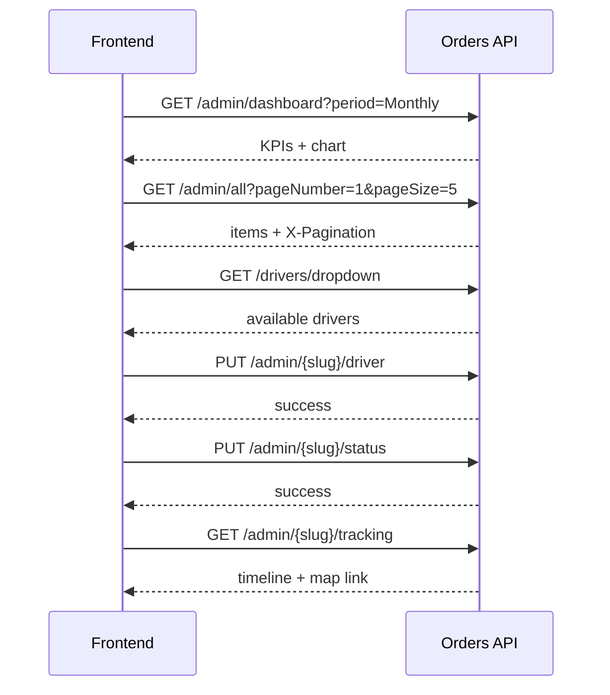

# Orders Admin Page — API Integration Guide

This document describes the backend APIs for the **Orders admin page** (dashboard, all-orders table, active shipment tracking, and driver assignment). Use it for frontend integration.

---

## Base URL

| Environment | URL |
|-------------|-----|
| Local HTTP | `http://localhost:5244` |
| Local HTTPS | `https://localhost:7168` |
| Swagger | `/swagger` |

All Orders routes are prefixed with:

```
/api/orders
```

Driver routes used by the Orders page:

```
/api/drivers
```

---

## Authentication

Authorization attributes are currently **commented out** in development. When enabled, admin endpoints will require the **Admin** role and a valid JWT in:

```
Authorization: Bearer <token>
```

Optional localization header (if configured):

```
Accept-Language: en | ar
```

---

## Standard response envelope

Most endpoints return a `Result<T>` wrapper:

```json
{
  "isSuccess": true,
  "data": { },
  "error": {
    "code": "",
    "message": ""
  },
  "status": "Success",
  "statusCode": "Success",
  "hasValue": true,
  "message": null
}
```

| HTTP status | Meaning |
|-------------|---------|
| `200` | Success |
| `400` | Bad request / validation / business rule |
| `403` | Forbidden / unauthorized |
| `404` | Not found |

On success, read the payload from **`data`**.

---

## Pagination (list endpoints)

Paginated endpoints add metadata in the response header:

```
X-Pagination: {"currentPage":1,"totalPages":3,"pageSize":5,"totalCount":12,"hasPrevious":false,"hasNext":true}
```

The response body still uses the `Result<T>` shape; list items are in `data.items`.

---

## Enums

### OrderStatus

| Value | Name | UI badge |
|------:|------|----------|
| `1` | OrderCreated | Grey |
| `2` | PickedUp | Blue |
| `3` | InLaundry | Purple |
| `4` | ReadyForDelivery | Orange |
| `5` | Delivered | Green |
| `6` | Cancelled | Red (chart / cancel) |

### PaymentStatus

| Value | Name |
|------:|------|
| `1` | Pending |
| `2` | Paid |
| `3` | Overdue |

### DashboardPeriod

| Value | Description |
|-------|-------------|
| `Weekly` | Chart: Mon of current week → today (daily buckets) |
| `Monthly` | Chart: 1st of current month → today (daily buckets) |
| `Quarterly` | Chart: 1st of current quarter → today (weekly buckets) |

### DriverStatus

| Value | Name |
|------:|------|
| `1` | Available |
| `2` | Unavailable |

---

## Screen mapping

### Screen 1 — Dashboard (KPIs + Order Analysis chart)

| UI section | Endpoint |
|------------|----------|
| Total Orders card + sparkline | `GET /api/orders/admin/dashboard` → `data.kpis.totalOrders` |
| Active Orders card + mini bar chart | `data.kpis.activeOrders` |
| Delivery Performance (on-time / delayed bars) | `data.kpis.deliveryPerformance` |
| Order Analysis chart + period dropdown | `data.chart` + query `period` |

### Screen 2 — All orders table

| UI section | Endpoint |
|------------|----------|
| Table rows | `GET /api/orders/admin/all` |
| Search | query `keyword` |
| Status filter | query `status` |
| Pagination | `pageNumber`, `pageSize` + header `X-Pagination` |
| Assign / Edit driver | `PUT /api/orders/admin/{slug}/driver` |
| Driver dropdown | `GET /api/drivers/dropdown` |
| Row detail (optional) | `GET /api/orders/admin/{slug}` |

### Screen 3 — Active shipment / tracking

| UI section | Endpoint |
|------------|----------|
| Order ID + status badge | `GET /api/orders/admin/{slug}/tracking` |
| Map | `data.branchMapLink` (embed Google Maps URL) |
| Branch address | `data.branchAddress` |
| Driver | `data.driverName`, `data.driverEmail` |
| Timeline (5 steps) | `data.timeline[]` |

**Note:** There is no dedicated “latest active shipment” endpoint. The frontend should pick an in-progress order from the list (`status` not `5` or `6`) or use a selected row’s `slug` for tracking.

---

## Endpoints

### 1. Dashboard

```
GET /api/orders/admin/dashboard?period=Monthly
```

**Query parameters**

| Param | Type | Default | Values |
|-------|------|---------|--------|
| `period` | string | `Monthly` | `Weekly`, `Monthly`, `Quarterly` |

**Response `data`**

```json
{
  "kpis": {
    "totalOrders": {
      "count": 3484,
      "deltaPercent": 1.1,
      "trendPoints": [
        { "label": "Oct", "count": 120 },
        { "label": "Nov", "count": 95 }
      ]
    },
    "activeOrders": {
      "count": 412,
      "deltaPercent": -3.3,
      "weeklyTrend": [
        { "dayLabel": "Mon", "activeCount": 48 },
        { "dayLabel": "Tue", "activeCount": 51 },
        { "dayLabel": "Wed", "activeCount": 52 }
      ]
    },
    "deliveryPerformance": {
      "onTime": 1186,
      "delayed": 132,
      "total": 1318
    }
  },
  "chart": {
    "totalOrders": 806,
    "fulfillmentRate": 87.1,
    "series": [
      { "label": "1 Jun", "delivered": 12, "cancelled": 2 },
      { "label": "2 Jun", "delivered": 15, "cancelled": 1 }
    ]
  }
}
```

**Frontend notes**

- `totalOrders.deltaPercent` — orders created this week vs last week.
- `activeOrders.weeklyTrend` — Mon–Sun of the **current ISO week** (mini bar chart).
- `deliveryPerformance.total` = `onTime + delayed` (use for progress bar %).
- `chart.fulfillmentRate` = `delivered / (delivered + cancelled) × 100` for the selected period window.
- Chart window is always **start of current period → today** (not a rolling “last N” window).

---

### 2. All orders (admin list)

```
GET /api/orders/admin/all?pageNumber=1&pageSize=5&keyword=&status=&sortBy=createdAt&sortDirection=desc
```

**Query parameters**

| Param | Type | Default | Description |
|-------|------|---------|-------------|
| `pageNumber` | int | `1` | Page index |
| `pageSize` | int | `50` | Rows per page |
| `keyword` | string | — | Search order #, customer name/email, branch, driver name/email |
| `status` | int | — | `OrderStatus` enum |
| `paymentStatus` | int | — | `PaymentStatus` enum |
| `companyId` | guid | — | Filter by company |
| `pickupDateFrom` | date | — | `YYYY-MM-DD` |
| `pickupDateTo` | date | — | `YYYY-MM-DD` |
| `sortBy` | string | `createdAt` | See sort options below |
| `sortDirection` | string | `desc` | `asc` or `desc` |

**Sort options (`sortBy`)**

`orderNumber`, `pickupDate`, `status`, `totalAmount`, `createdAt`, `customerName`, `driverName`, `expectedDelivery`, `bagCount`

**Response `data.items[]`**

```json
{
  "id": "guid",
  "slug": "ord-20260001-abc123",
  "orderNumber": "ORD-20260001-ABC123",
  "customerName": "Gulf Hospitality Group",
  "customerEmail": "contact@gulf.com",
  "companyType": "Hotel",
  "branchName": "Downtown Branch",
  "pickupDate": "2026-06-09",
  "expectedDeliveryDate": "2026-06-10",
  "bagCount": 12,
  "driverId": "guid-or-null",
  "driverSlug": "khalid-hassan-or-null",
  "driverName": "Khalid Hassan",
  "driverEmail": "khalid@example.com",
  "status": 2,
  "paymentStatus": 1,
  "totalAmount": 450.00,
  "createdAt": "2026-06-08T10:30:00Z"
}
```

**Frontend notes**

- If `driverId` is `null` → show **Assign** button.
- If `driverId` is set → show driver name, email, and **Edit** action.
- Customer/driver avatars (initials) are **not** returned — derive client-side from `customerName` / `driverName`.
- `expectedDeliveryDate` = `pickupDate + 1 day` (server-calculated).

---

### 3. Order detail (admin)

```
GET /api/orders/admin/{slug}
```

**Response `data`** — same fields as list item, plus:

```json
{
  "branchAddress": "123 Main St",
  "timeSlotLabel": "9:00 AM - 11:00 AM",
  "additionalNotes": "Handle with care",
  "totalItems": 12,
  "items": [
    {
      "id": "guid",
      "itemName": "Bed Sheet",
      "category": 1,
      "quantity": 4,
      "unitPrice": 25.00,
      "subtotal": 100.00
    }
  ]
}
```

---

### 4. Order tracking (timeline + map)

```
GET /api/orders/admin/{slug}/tracking
```

**Response `data`**

```json
{
  "orderNumber": "ORD-20260001-ABC123",
  "currentStatus": 3,
  "branchMapLink": "https://maps.google.com/...",
  "branchAddress": "Downtown Branch",
  "driverName": "Khalid Hassan",
  "driverEmail": "khalid@example.com",
  "timeline": [
    {
      "status": 1,
      "label": "Order Created",
      "occurredAt": "2026-06-13T09:21:00Z",
      "isActual": true
    },
    {
      "status": 4,
      "label": "Ready for Delivery",
      "occurredAt": "2026-06-14T14:00:00Z",
      "isActual": false
    }
  ]
}
```

**Timeline rules**

- Always **5 steps**: OrderCreated → PickedUp → InLaundry → ReadyForDelivery → Delivered.
- `isActual: true` — completed step with a real timestamp from status history.
- `isActual: false` — estimated future step.
- `Cancelled` orders are not steps in the timeline; use `currentStatus` from list/detail (`6`).

---

### 5. Update order status

```
PUT /api/orders/admin/{slug}/status
Content-Type: application/json
```

**Body**

```json
{
  "status": 3
}
```

**Behavior**

- Writes a row to `OrderStatusHistories` with current UTC time.
- When `status` is `5` (Delivered), sets `actualDeliveredAt` on the order.
- Cannot update orders already **Delivered** (`5`) or **Cancelled** (`6`).
- To cancel: send `"status": 6`.

---

### 6. Assign / unassign driver

```
PUT /api/orders/admin/{slug}/driver
Content-Type: application/json
```

**Assign**

```json
{
  "driverId": "3fa85f64-5717-4562-b3fc-2c963f66afa6"
}
```

**Unassign**

```json
{
  "driverId": null
}
```

**Rules**

- Driver must exist and have status **Available** (`1`).
- Cannot assign to Delivered or Cancelled orders.

---

## Driver endpoints (used by Orders page)

### Drivers dropdown (assign modal)

```
GET /api/drivers/dropdown?includeAll=false
```

| Param | Default | Description |
|-------|---------|-------------|
| `includeAll` | `false` | When `false`, only **Available** drivers |

**Response `data[]`**

```json
{
  "id": "guid",
  "slug": "khalid-hassan",
  "fullName": "Khalid Hassan",
  "email": "khalid@example.com",
  "status": 1
}
```

### Full driver module (admin management)

| Method | Endpoint | Purpose |
|--------|----------|---------|
| `GET` | `/api/drivers/admin/all` | Paginated driver list |
| `GET` | `/api/drivers/admin/{slug}` | Driver detail |
| `POST` | `/api/drivers/create` | Create driver + user account |
| `PUT` | `/api/drivers/{slug}` | Update driver |
| `PATCH` | `/api/drivers/{slug}/status` | Toggle Available ↔ Unavailable |
| `DELETE` | `/api/drivers/{slug}` | Delete driver |

**Create driver body**

```json
{
  "fullName": "Khalid Hassan",
  "email": "khalid@example.com",
  "phone": "+966500000000",
  "password": "Driver@123",
  "photo": null,
  "status": 1
}
```

> Requires the **Driver** role to exist in the database (seeded via `IdentitySeeder`).

---

## Recommended integration flow



---

## Example requests (curl)

**Dashboard**

```bash
curl "http://localhost:5244/api/orders/admin/dashboard?period=Monthly"
```

**List with filter**

```bash
curl "http://localhost:5244/api/orders/admin/all?pageNumber=1&pageSize=5&status=3&sortBy=pickupDate&sortDirection=asc"
```

**Assign driver**

```bash
curl -X PUT "http://localhost:5244/api/orders/admin/{slug}/driver" \
  -H "Content-Type: application/json" \
  -d "{\"driverId\": \"DRIVER-GUID-HERE\"}"
```

**Update status**

```bash
curl -X PUT "http://localhost:5244/api/orders/admin/{slug}/status" \
  -H "Content-Type: application/json" \
  -d "{\"status\": 3}"
```

**Tracking**

```bash
curl "http://localhost:5244/api/orders/admin/{slug}/tracking"
```

---

## Not implemented (frontend workarounds)

| Feature | Workaround |
|---------|------------|
| Active shipment auto-pick | Select first non-terminal order from list, or let user click a row |
| Bulk actions (checkboxes) | Not available yet |
| Row action menu (delete, etc.) | Use status update to Cancel (`6`) if needed |
| Status filter dropdown API | Use `OrderStatus` enum values client-side |
| Customer/driver avatar URLs | Build initials from name fields in UI |

---

## Changelog

| Date | Change |
|------|--------|
| 2026-06-23 | Initial Orders admin API: dashboard, list, tracking, driver assign, driver module |
