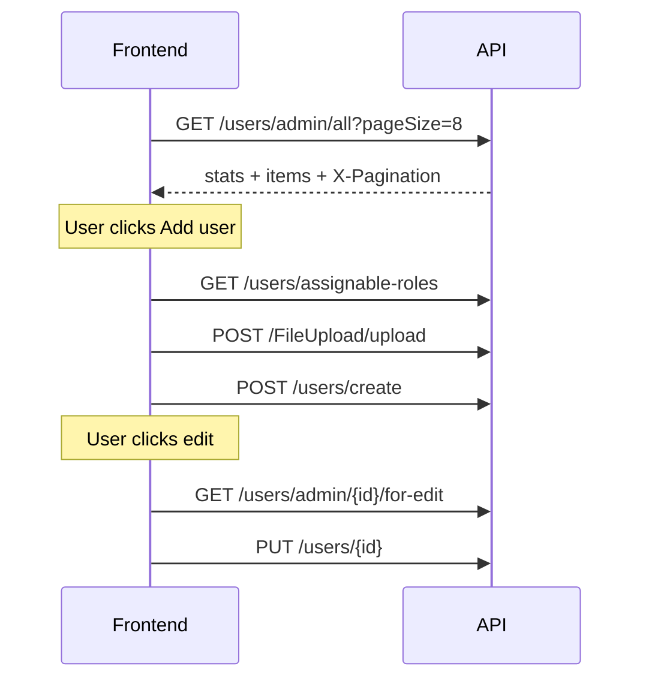

# Users — Admin API Integration Guide

Backend API for the **User Management** admin page: KPI cards, searchable/filterable user directory, create/edit staff users, status changes, and bulk actions.

Related docs:

- [DRIVERS-ADMIN-API.md](./DRIVERS-ADMIN-API.md) — Driver accounts (separate from staff users)
- [FRONTEND-API-HANDOFF.md](./FRONTEND-API-HANDOFF.md) — Cross-cutting API notes

---

## Base URL

| Environment | URL |
|-------------|-----|
| Local HTTP | `http://localhost:5244` |
| Local HTTPS | `https://localhost:7168` |
| Swagger | `/swagger` |

User routes are under:

```
/api/users
```

Photo upload uses:

```
/api/FileUpload/upload
```

---

## Authentication

Authorization is commented out in development. When enabled, **admin JWT** required:

```
Authorization: Bearer <token>
Accept-Language: en | ar
```

---

## Standard response envelope

```json
{
  "isSuccess": true,
  "data": { },
  "error": { "code": "", "message": "" },
  "status": "Success",
  "statusCode": "Success",
  "hasValue": true,
  "message": null
}
```

Paginated list adds `X-Pagination` header:

```json
{"currentPage":1,"totalPages":2,"pageSize":8,"totalCount":12,"hasPrevious":false,"hasNext":true}
```

---

## TypeScript models

```typescript
interface ImageDto {
  path: string | null;
  url: string;
}

enum UserStatus {
  Active = 1,
  Inactive = 2,
  Suspended = 3
}

interface UserStatDto {
  key: 'totalUsers' | 'activeUsers' | 'inactiveUsers' | 'suspendedUsers';
  value: number;
  sparkline: { date: string; value: number }[];
}

interface UserListItemDto {
  id: string;
  fullName: string;
  email: string;
  phone: string;
  initials: string;
  photo: ImageDto | null;
  roleId: string;
  roleName: string;
  status: UserStatus;
  statusLabel: string;
  lastLoginAt: string | null;
  hasSignedIn: boolean;
  createdAt: string;
}

interface AssignableRoleDto {
  id: string;
  name: string;
  description: string;
}
```

---

## Enums

### UserStatus

| Value | Name | UI label | Can sign in |
|------:|------|----------|-------------|
| `1` | Active | Active | Yes |
| `2` | Inactive | Inactive | No |
| `3` | Suspended | Suspended | No |

---

## Scope rules

**User Management creates staff dashboard users only.**

| Role | In assignable dropdown | In user list |
|------|------------------------|--------------|
| Admin, BranchManager, OperationsSupervisor, LaundryUser, SupportAgent, custom active roles | Yes | Yes |
| Company, Driver, PendingCompany, User | No — use Companies / Drivers modules | No |

---

## Screen mapping

### Page load

| UI section | Endpoint |
|------------|----------|
| KPI cards (Total / Active / Inactive / Suspended) | `GET /api/users/admin/all` → `data.stats` |
| Users table | `GET /api/users/admin/all` → `data.items` |

### Add user modal

| UI action | Endpoint |
|-----------|----------|
| Role dropdown | `GET /api/users/assignable-roles` |
| Photo upload | `POST /api/FileUpload/upload` → use `data.filePath` as `photo` |
| Submit | `POST /api/users/create` |

### Row actions

| UI action | Endpoint |
|-----------|----------|
| Edit — preload | `GET /api/users/admin/{id}/for-edit` |
| Edit — save | `PUT /api/users/{id}` |
| Change status | `PATCH /api/users/{id}/status` |
| Delete | `DELETE /api/users/{id}` |
| Bulk status | `POST /api/users/bulk-status` |
| Bulk delete | `DELETE /api/users` |

---

## Endpoints

### 1. List users (with KPI stats)

```
GET /api/users/admin/all?pageNumber=1&pageSize=8&keyword=&status=&roleId=&sortBy=createdAt&sortDirection=desc&trendYear=2026&trendMonth=6
```

**Query parameters:**

| Param | Default | Values |
|-------|---------|--------|
| `pageNumber` | `1` | |
| `pageSize` | `8` | Match UI rows selector |
| `keyword` | — | name, email, phone, role name |
| `status` | — | `1` Active, `2` Inactive, `3` Suspended |
| `roleId` | — | Guid |
| `sortBy` | `createdAt` | `fullName`, `email`, `status`, `lastLoginAt`, `createdAt` |
| `sortDirection` | `desc` | `asc` / `desc` |
| `trendYear`, `trendMonth` | current month | Sparkline data for KPI cards |

**Response `data`:**

```json
{
  "stats": [
    { "key": "totalUsers", "value": 6, "sparkline": [{ "date": "2026-06-01", "value": 1 }] },
    { "key": "activeUsers", "value": 3, "sparkline": [] },
    { "key": "inactiveUsers", "value": 2, "sparkline": [] },
    { "key": "suspendedUsers", "value": 1, "sparkline": [] }
  ],
  "items": [
    {
      "id": "3fa85f64-5717-4562-b3fc-2c963f66afa6",
      "fullName": "Mohamed Hassan",
      "email": "mohamed@cleno.com",
      "phone": "+966512345678",
      "initials": "MH",
      "photo": { "path": "uploads/users/photo.jpg", "url": "https://localhost:7168/uploads/users/photo.jpg" },
      "roleId": "guid",
      "roleName": "Admin",
      "status": 1,
      "statusLabel": "Active",
      "lastLoginAt": "2026-06-28T14:00:00Z",
      "hasSignedIn": true,
      "createdAt": "2026-01-15T10:00:00Z"
    }
  ]
}
```

When `hasSignedIn === false`, show **"Never signed in"** in the Activity column.

---

### 2. Assignable roles (dropdown)

```
GET /api/users/assignable-roles
```

**Response `data`:**

```json
[
  { "id": "guid", "name": "Admin", "description": "Admin" },
  { "id": "guid", "name": "BranchManager", "description": "Branch Manager" }
]
```

Use `description` for display label in the dropdown.

---

### 3. Create user

```
POST /api/users/create
```

**Body:**

```json
{
  "fullName": "Sarah Ahmed",
  "email": "user@company.com",
  "phone": "+966512345678",
  "roleId": "guid",
  "status": 1,
  "password": "TempPass@123",
  "photo": "uploads/users/photo.jpg"
}
```

**Response `data`:** `"3fa85f64-5717-4562-b3fc-2c963f66afa6"` (user id as Guid)

---

### 4. Get user for edit

```
GET /api/users/admin/{id}/for-edit
```

**Response `data`:**

```json
{
  "id": "guid",
  "fullName": "Sarah Ahmed",
  "email": "user@company.com",
  "phone": "+966512345678",
  "roleId": "guid",
  "status": 1,
  "photo": { "path": "uploads/...", "url": "https://..." }
}
```

No password on edit.

---

### 5. Update user

```
PUT /api/users/{id}
```

**Body:** same as create except no `password`.

**Response `data`:** `true`

---

### 6. Update status

```
PATCH /api/users/{id}/status
```

**Body:**

```json
{ "status": 3 }
```

**Response `data`:**

```json
{ "status": 3, "statusLabel": "Suspended" }
```

---

### 7. Bulk update status

```
POST /api/users/bulk-status
```

**Body:**

```json
{
  "userIds": ["guid-1", "guid-2"],
  "status": 1
}
```

**Response `data`:** `2` (count of updated users)

---

### 8. Delete user

```
DELETE /api/users/{id}
```

**Response `data`:** `true`

**Blocked when:**

- User is linked to a Company or Driver record
- User is the last Admin in the system

---

### 9. Bulk delete

```
DELETE /api/users
```

**Body:**

```json
{ "userIds": ["guid-1", "guid-2"] }
```

**Response `data`:** number of successfully deleted users

---

### 10. Get user detail

```
GET /api/users/admin/{id}
```

Same shape as list item (`UserListItemDto`).

---

## Login behavior

Inactive and Suspended users cannot sign in. Login returns **403 Forbidden** with a localized message.

On successful login, `lastLoginAt` is updated automatically.

---

## Recommended page load sequence



---

## Database migration

Apply before using User Management:

```bash
dotnet ef database update --project Cleno.Persistence --startup-project Cleno.API
```

Migration: `AddUserStatusAndActivityFields` — adds `Status`, `CreatedAt`, `LastLoginAt` to `AspNetUsers`.

New staff roles are seeded via `IdentitySeeder` and `02-identity.sql`:

- BranchManager
- OperationsSupervisor
- LaundryUser
- SupportAgent

---

## Changelog

| Date | Change |
|------|--------|
| 2026-06-29 | Initial User Management admin API |
